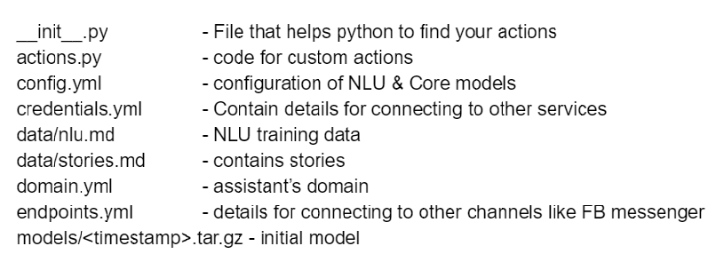

<h3> Steps for building Rasa Chatbot</h3> 
<B> Step1 : Install python virtual environment. </B>
    &emsp; &emsp; python3 -m venv env_name  
<B> Step2 : Activate virtual environment. </B>
    &emsp; &emsp; env_name\Scripts\activate 
    
<B> Step3 : Install Rasa</B> 
    &emsp; &emsp; pip install rasa 
  
<B> Step4 : Install Rasa-X to your system: </B>
	&emsp;&emsp; pip install rasa-x --extra-index-url https://pypi.rasa.com/simple 
    
<B> Step5 : Initialize sample bot by running following command :</B> 
    &emsp; &emsp; rasa init --no-prompt

When this will be successfully done, it will create different files  and directories in your current directory in the format shown below:

Also, this will train your model for the first time with this command.

<B> Step6 : To train your model again, run following command: </B>
	&emsp; &emsp; rasa train

<B> Step7 : To chat with Rasa-X chatbot, run following command: </B>
	&emsp; &emsp; rasa x    

This command will open your interactive Rasa X chatbot in the browser to start talking to your bot.

Your sample chatbot is ready, in case you want to develop chatbot for your own usecase,  add stories and trainig data to stories.md, and nlu.md files respectively.
